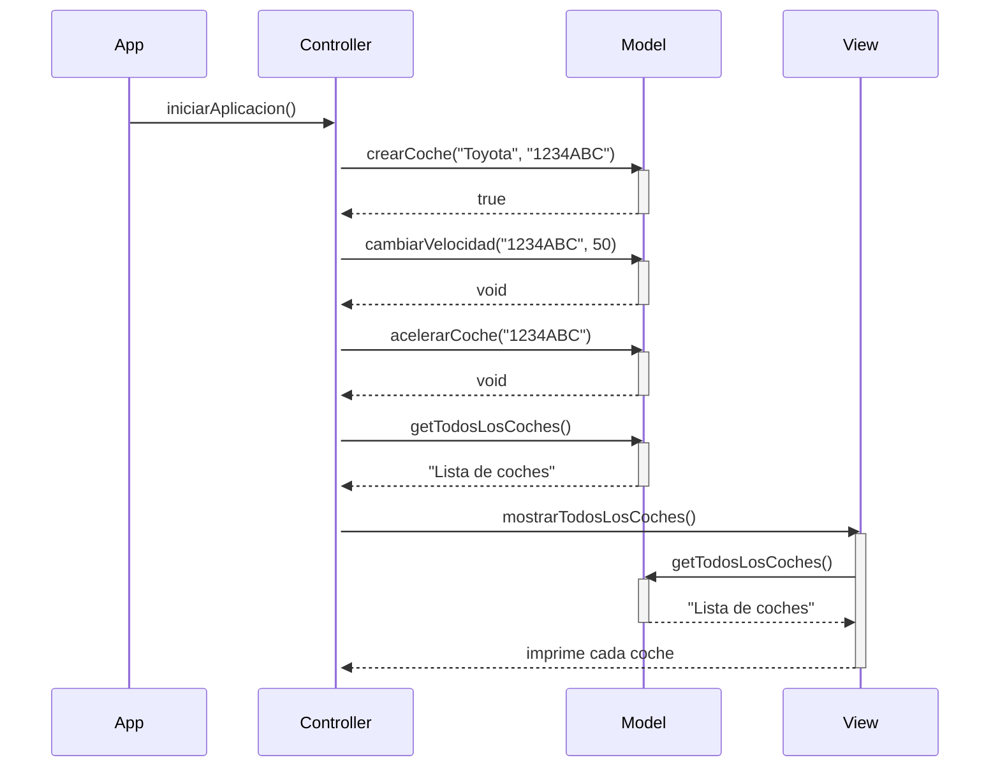

# 🚗 Sistema de Gestión de Coches

## 🎯 Objetivo

Este proyecto implementa una aplicación básica para la gestión de coches siguiendo el patrón de arquitectura **MVC (Modelo - Vista - Controlador)**.

Funcionalidades implementadas:
- ✅ Crear coche
- ✅ Aumentar velocidad
- ✅ Disminuir velocidad
- ✅ Mostrar todos los coches

---

## 🧱 Arquitectura MVC

### Diagrama Mermaid

### Diagrama de secuencia Mermaid

