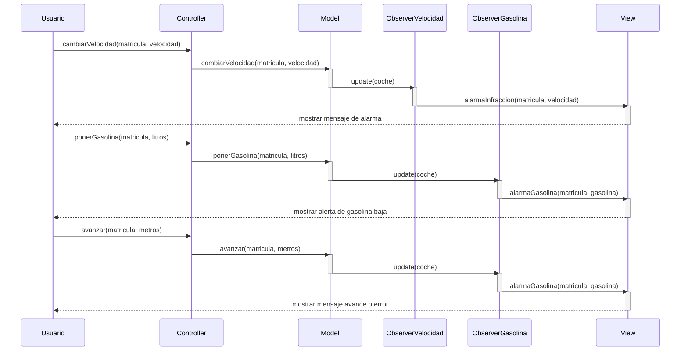

# 🚗 Proyecto MVC con Alerta de Gasolina y Velocidad

- El coche va muy rápido (más de 120 km/h) o muy lento (menos de 90 km/h).
- La gasolina baja de 10 litros.

---

## ¿Cómo está organizado el proyecto?

- **Model**: guarda la info de los coches.
- **View**: muestra mensajes en pantalla.
- **Controller**: hace de intermediario entre Model y View.
- **Observadores**: detectan cambios importantes (velocidad y gasolina) para lanzar alertas.

---

## ¿Qué hice y por qué?

### Antes tenía problemas como:

- No se avisaba bien cuando la gasolina estaba baja.
- Al avanzar el coche y consumir gasolina, no avisaba que la gasolina bajó.

### Cambios:

- Creé un **ObserverGasolina** que solo se fija en el nivel de gasolina y avisa cuando baja de 10 litros.
- Ahora lanza una alerta con la cantidad que queda.
- Cuando el coche avanza y consume gasolina, se notifica automáticamente al observador para ver si hay alerta.
- Añadí JavaDocs para que el código sea más claro y fácil de seguir.

---

## Final
PAra cheqeuar que funcionaba, lo probe varias veces.

---

```mermaid
sequenceDiagram
    participant Usuario
    participant Controller
    participant Model
    participant ObserverVelocidad
    participant ObserverGasolina
    participant View

    Usuario->>Controller: cambiarVelocidad(matricula, velocidad)
    Controller->>Model: cambiarVelocidad(matricula, velocidad)
    activate Model

    Model->>ObserverVelocidad: update(coche)
    deactivate Model
    activate ObserverVelocidad

    ObserverVelocidad->>View: alarmaInfraccion(matricula, velocidad)
    deactivate ObserverVelocidad
    activate View
    View-->>Usuario: mostrar mensaje de alarma
    deactivate View

    Usuario->>Controller: ponerGasolina(matricula, litros)
    Controller->>Model: ponerGasolina(matricula, litros)
    activate Model

    Model->>ObserverGasolina: update(coche)
    deactivate Model
    activate ObserverGasolina

    ObserverGasolina->>View: alarmaGasolina(matricula, gasolina)
    deactivate ObserverGasolina
    activate View
    View-->>Usuario: mostrar alerta de gasolina baja
    deactivate View

    Usuario->>Controller: avanzar(matricula, metros)
    Controller->>Model: avanzar(matricula, metros)
    activate Model
    Model->>ObserverGasolina: update(coche)
    deactivate Model
    activate ObserverGasolina
    ObserverGasolina->>View: alarmaGasolina(matricula, gasolina)
    deactivate ObserverGasolina
    activate View
    View-->>Usuario: mostrar mensaje avance o error
    deactivate View

```